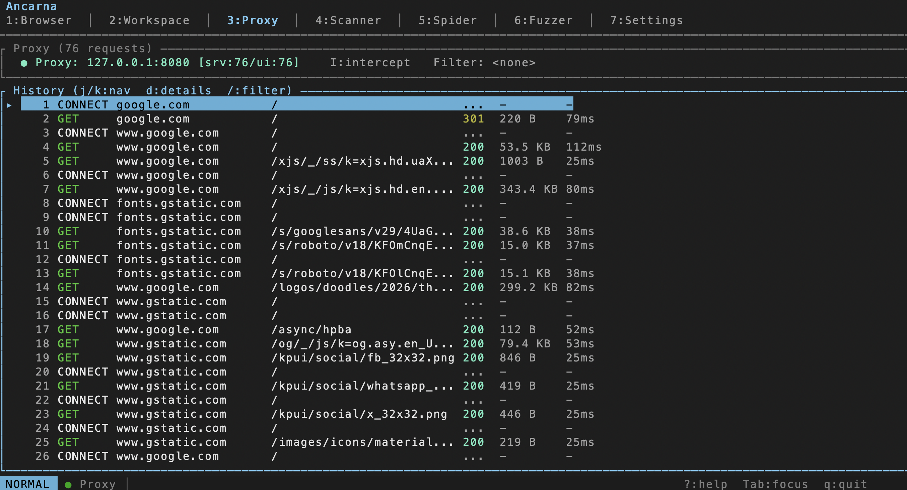

# Ancarna

**Web Proxy Security in Your Terminal**



A lightweight terminal-based web security testing tool. Intercept, inspect, and analyze HTTP/HTTPS traffic without leaving your terminal.

## Features

- **HTTPS Intercepting Proxy** - MITM proxy with on-the-fly certificate generation
- **Request Editor** - Modify and replay requests with vim-style navigation
- **Passive Scanner** - Automatic detection of security issues (headers, cookies, CSP, CORS)
- **Findings View** - Tree view grouped by host with filtering (`!pattern` to exclude)
- **Intercept Mode** - Pause, edit, and forward/drop requests

## Install

```bash
cargo install --git https://github.com/icryo/ancarna
```

Or build from source:
```bash
git clone https://github.com/icryo/ancarna
cd ancarna
cargo build --release
```

## Quick Start

```bash
# Start ancarna
ancarna

# Configure your browser to use proxy at 127.0.0.1:8080
# Press 'C' to install the CA certificate for HTTPS interception
```

## Keys

| Key | Action |
|-----|--------|
| `1-7` | Switch tabs |
| `j/k` | Navigate up/down |
| `Tab` | Cycle focus |
| `I` | Toggle intercept |
| `f` | Forward request |
| `x` | Drop request |
| `d` | View details |
| `/` | Filter |
| `?` | Help |

## License

MIT
